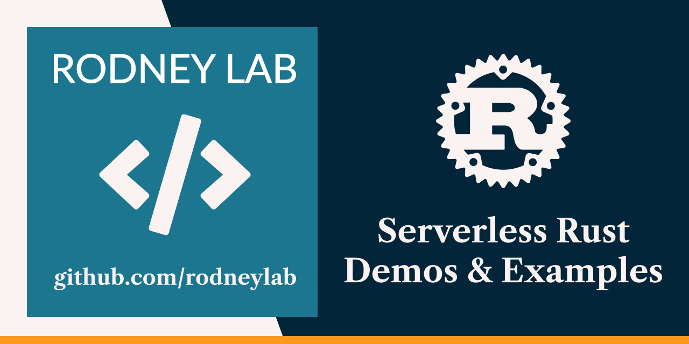

  

<h1 align="center">
  Serverless Rust Demos and Examples
</h1>

# serverless-rust

Code to <a aria-label="Open Rodney Lab Serverless Rust articles" href="https://rodneylab.com/tags/serverless/">accompany Serverless Rust articles</a>. Each folder under `./demos` relates to a Serverless Rust article. Try out the code and see the linked post in the folder README.md for more details. If you have any questions, please drop a comment at the bottom of the linked post. You can also <a aria-label="Reach out to Rodney on Twitter" href="https://twitter.com/intent/user?screen_name=askRodney">reach out to @askRodney on Twitter</a>.

Feel free to jump into the [Rodney Lab matrix chat room](https://matrix.to/#/%23rodney:matrix.org).
