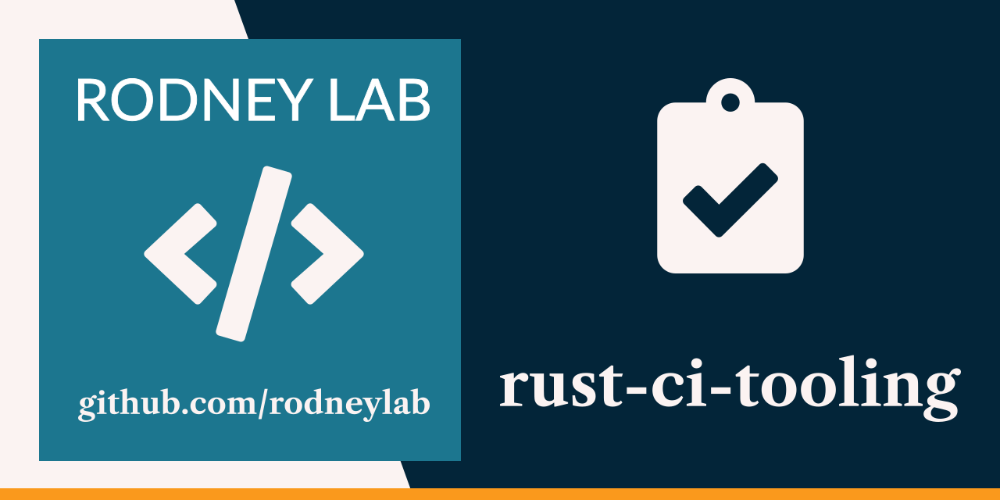

<p align="center">
  <a aria-label="Open Rodney Lab site" href="https://rodneylab.com" rel="nofollow noopener noreferrer">
    
  </a>
</p>
<h1 align="center">
  Rust Continuous Integration Tooling
</h1>

# rust-ci-tooling

Final code from Rodney Lab <a aria-label="Open Rodney Lab blog post on Mux Serverless Webhook Updates" href="https://rodneylab.com/rust-ci-tooling/">video on Rust continuous tooling</a>, which looks at how to set up tools like commitizen, commitlint and pre-commit and use them with conventional commits and cargo linting tools in your Rust project.

## Rust Continuous Integration Tooling

This code is designed for compiling Rust to WebAssembly and publishing the resulting worker to Cloudflare's [edge infrastructure](https://www.cloudflare.com/network/).

## Usage 

With `wrangler`, you can build, test, and deploy your Worker with the following commands: 

```bash
# compiles your project to WebAssembly and will warn of any issues
wrangler build 

# run your Worker in an ideal development workflow (with a local server, file watcher & more)
wrangler dev

# deploy your Worker globally to the Cloudflare network (update your wrangler.toml file for configuration)
wrangler publish
```

Read the latest `worker` crate documentation here: https://docs.rs/worker

## WebAssembly

`workers-rs` (the Rust SDK for Cloudflare Workers used in this template) is meant to be executed as 
compiled WebAssembly, and as such so **must** all the code you write and depend upon. All crates and
modules used in Rust-based Workers projects have to compile to the `wasm32-unknown-unknown` triple. 

Read more about this on the [`workers-rs` project README](https://github.com/cloudflare/workers-rs).

## Issues

Feel free to jump into the [Rodney Lab matrix chat room](https://matrix.to/#/%23rodney:matrix.org).